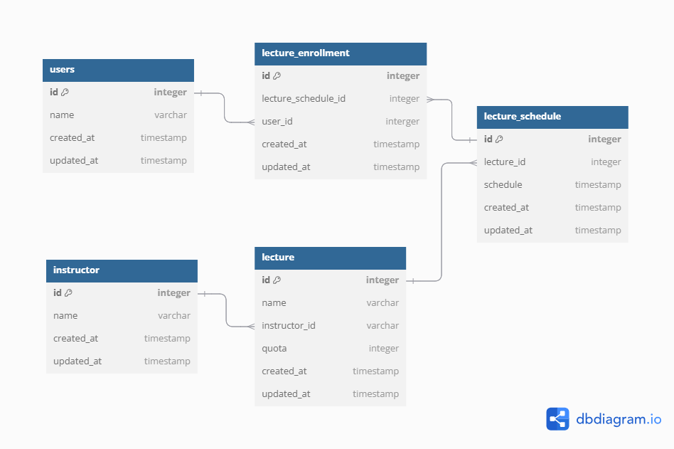

# ERD

## ERD 설계 이유
### lecture , lecture_schedule 테이블 분리
- 강의에 대한 기본 정보인 강의명, 강연자 정보는 강연 스케줄과 별도로 반복되는 정보이므로 정규화 작업을 하였습니다.
- 강의 수강 정원(quota)은 스케줄에 따라 다르지 않고, 강의에 대한 정보이므로 lecture 테이블에 추가하였습니다.

### lecture_enrollment 테이블
- 수강생은 여러 강의를 등록할 수 있고, 강의도 여러 수강생을 가질 수 있습니다. 
이를 위해 N:M 관계를 연결해주는 lecture_enrollment 테이블을 생성하였습니다.
- 수강생이 강의를 신청할 때, 같은 스케줄에 중복 신청을 방지하기 위해 
lecture_schedule_id, user_id 복합 컬럼으로 unique index를 걸어두었습니다.

### instructor, users 테이블 분리
- 강의자와 수강생으로 서로 다른 도메인을 나타내므로 별도의 테이블로 분리하였습니다.

### AUTO_INCREMENT로 Primary Key 설정
- 각 테이블의 id 컬럼은 insert 상의 성능을 고려하여 숫자형(biginteger)의 AUTO INCREMENT로 설정하였습니다.
- 성능을 위해 auto increment 를 PK로 설정한 이유는 다음과 같습니다.
- Mysql innoDB는 PK를 클러스터형 인덱스로 설정합니다. 이는 비슷한 값을 가진 데이터를 묶어서 저장하는 방식입니다.
- AUTO_INCREMENT로 설정된 PK는 순차적으로 증가하므로 삽입시 데이터의 위치를 찾는데 유리합니다.
- 반면, 업무 식별자를 PK로 사용할 경우 비순차적인 값이 포함될 가능성이 있어 데이터가 랜덤한 위치에 삽입될 수 있습니다.
  데이터가 랜덤한 위치에 삽입되면 재배치(rebalancing)가 발생할 수 있으며, 이 과정에서 인덱스가 재구성되면서 디스크 I/O가 증가하게 됩니다.
  이는 데이터 insert 시 성능 저하를 가져올 수 있습니다.

---

# 요구사항 분석
### 특강 신청

- 특정 userId 로 `선착순`으로 제공되는 특강을 신청
    - 모든 특강 정원은 30명
- 신청 가능 조건
    1. 시작하지 않은 특강만 신청할 수 있다.
        - 유효성 확인 실패 응답: 이미 시작한 특강 입니다.
    2. 중복신청: 동일한 신청자는 동일한 강의에 대해서 한 번의 수강 신청만 성공
        - 중복 신청시 응답 : 이미 신청한 특강입니다.
    3. 선착순: 이미 신청자가 30명이 초과 되면 이후 신청자는 요청을 실패
        - 선착순 완료시 응답 : 신청 정원이 초과되었습니다
- 입력값
    - userId, 특강Id, 특강 날짜

### 특강 신청 가능 목록

- 날짜별 현재 `신청 가능한` 특강 목록을 조회
    - 신청자 수가 특강 정원보다 적은 경우
    - 아직 시작하지 않은 특강
- 특강에 신청하기 전 `목록을 조회`해 볼 수 있어야 한다.
    - 입력값
        - 날짜(YYYYMMDD)
    - 응답값 목록
        - 특강ID, 특강 이름,  특강 스케줄, 강연자 이름, 특강 신청자 수

### 특강 신청 완료 목록 조회

- 특정 userId 로 `신청 완료된 특강 목록`을 조회
- 입력값
    - userId
- 응답값
    - 특강ID, 특강 날짜, 특강명, 강연자 정보(강연자명, 강연자ID)

---
# TC 정리 (실패하면 안되는 Input 정리)

### 특강 신청 기능

**입력값:**

- `userId`: 신청자를 식별하는 고유 값
- `특강Id`: 신청할 특강을 식별하는 고유 값
- `특강 날짜`: 특강이 진행되는 날짜 (YYYYMMDD)

**실패하면 안 되는 Input 정의:**

1. **유효한 `userId`:**
    - 존재하지 않는 사용자의 ID일 경우 실패.
    - 형식 오류: null, 빈 값, 잘못된 형식 (숫자만가능)
2. **유효한 `특강Id`:**
    - 해당 특강이 존재하지 않을 경우 실패.
    - 형식 오류: null, 빈 값, 잘못된 형식 (숫자만가능)
3. **유효한 `특강 날짜,시간`:**
    - 잘못된 날짜 형식 (날짜 `YYYYMMDD HH:DD` 형식이 아닌 값).
    - 현재 날짜보다 이전 날짜( 특강 스케쥴)로 신청 시 실패.
    - 특강이 없는 날짜일 경우 실패.
4. **비즈니스 로직 유효성:**
    - 이미 시작한 특강에 대한 신청 요청 실패.
    - 동일 특강에 대해 동일 사용자의 중복 신청 실패.
    - 신청 정원이 초과된 특강에 대한 신청 실패.

### 특강 신청 가능 목록 조회 기능

**입력값:**

- [x]  `날짜`: 신청 가능 목록을 조회하려는 날짜 (YYYYMMDD)
    - [x]  오늘이면 LocalDateTime.now() 사용
    - [x]  오늘 이후이면 localDate.toStartOfDay() 사용

**응답값**

- 특강ID, 특강 이름,  강연자 이름, 특강스케줄ID, 특강 스케줄, ~~특강 신청자 수~~

**실패하면 안 되는 Input 정의:**

1. **유효한 `날짜`:**
    - [x]  잘못된 날짜 형식 (예: `YYYYMMDD` 형식이 아닌 값).
    - [x]  null인 경우 실패.
    - [x]  요청한 날짜가 오늘보다 이전일 경우 실패.

### 특강 신청 완료 목록 조회 기능

- [ ]  특정 userId 로 `신청 완료된 특강 목록`을 조회

**입력값:**

- [ ]  `userId`: 신청 완료된 특강 목록을 조회하려는 사용자 ID

**응답값**

- 특강ID, 특강 날짜, 특강명, 강연자 정보(강연자명, 강연자ID)

**실패하면 안 되는 Input 정의:**

**유효한 `userId`**
- [x]  존재하지 않는 사용자의 ID일 경우 실패.   
- [ ]  형식 오류: null